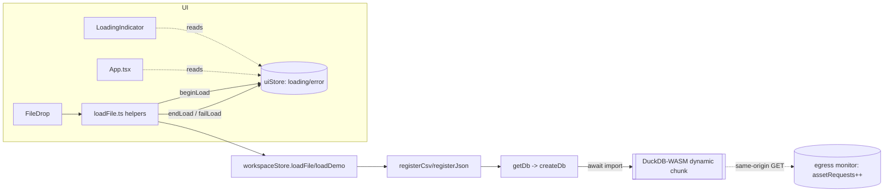
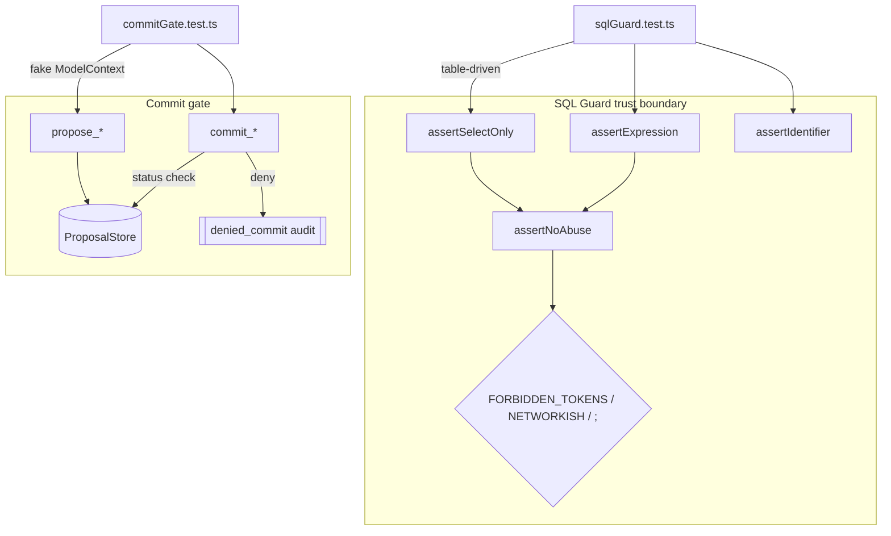

# Design Document: submission-hardening

## Overview

Airlock is an agent-native, browser-only data workspace for the OpenAI WebMCP
Challenge. The application is already functional (typecheck passes, production
build succeeds). This feature closes the three remaining submission-quality gaps
identified in `requirements.md`, under a hard ~2-day deadline. The guiding
principle is **minimal, execution-ready, reuse-first** — no speculative
abstractions, no rewrites of shipped code.

The work splits into three independent workstreams:

- **Workstream A — README integrity + capture setup** (Requirements 1, 2). Make
  the root README gallery render cleanly today and auto-upgrade when real PNGs
  arrive; confirm the capture guide satisfies R2.
- **Workstream B — trust-guarantee test suite** (Requirements 3, 4, 5). Stand up
  Vitest for the monorepo and prove the two core trust guarantees: the SQL guard
  (`duckdb.ts`) rejects unsafe SQL, and the propose→commit gate
  (`webmcp-staged/core.ts`) never applies a change without prior human approval.
- **Workstream C — cold-start UX + code-splitting** (Requirements 6, 7). Show a
  loading indicator within 200 ms of a load, and code-split the DuckDB-WASM
  engine so no JS app chunk exceeds Vite's 500 kB advisory — all while egress
  stays at zero.

The three workstreams touch disjoint files and can be executed in any order or in
parallel. None of them modify the base-table-immutable, honest-read/write-split,
or zero-egress invariants; Workstream C explicitly re-verifies them.

### Key existing facts this design relies on (verified in-repo)

- `apps/airlock/src/engine/duckdb.ts` exports `assertSelectOnly`,
  `assertExpression`, `assertIdentifier`. These are **pure string functions**
  backed by a shared private validator `assertNoAbuse` plus helpers
  (`stripComments`, `neutralizeStrings`, `FORBIDDEN_TOKENS`, `NETWORKISH`). They
  have no dependency on a live DuckDB instance.
- **However**, `duckdb.ts` has Vite-only top-level imports
  (`import x from "@duckdb/duckdb-wasm/dist/…?url"`). Importing the module under
  plain Vitest/Node resolution would need those `?url` specifiers handled. This
  is the central testability constraint for Workstream B (addressed below).
- `packages/webmcp-staged/src/core.ts` exports `registerStagedTool`,
  `ProposalStore`, `defaultProposalStore`, `getModelContext`, types `Proposal`,
  `StagedAuditEvent`, `StagedAudit`. Commit gating lives in the `commit_<name>`
  tool's `execute`: it denies on missing / `rejected` / non-`approved`
  proposals, emits a `denied_commit` audit event via `deny()`, and `remove()`s
  the proposal **before** awaiting `commit()` (double-apply guard).
- `apps/airlock/src/lib/egress.ts` classifies same-origin non-body GETs as
  `assetRequests` and everything else as `externalRequests`. Dynamic import
  chunks from our own origin are same-origin GETs → counted as asset loads, not
  external. This is what keeps Workstream C's egress claim true.
- The load entry points are `workspaceStore.loadFile(file)` and
  `workspaceStore.loadDemo(url, name)`, invoked from `FileDrop.tsx`. `App.tsx`
  swaps `<EmptyState/>` for the workspace when `state.loaded` is true.
- `docs/screenshots/` already contains `CAPTURE-GUIDE.md` and `README.md`. The
  six PNGs (`01-empty-state.png`…`06-agent-console.png`) do **not** exist, so the
  root README's gallery table currently renders six broken images.
- Tailwind semantic tokens already defined: `ink.*`, `airlock.*`, `pending`,
  `commit`, `danger`, plus animations `pending-pulse`, `commit-flash`,
  `slide-in`. The loading indicator must draw only from these.

---

## Architecture

### Workstream A — README integrity + capture setup

**Decision: commit lightweight placeholder PNGs at the six exact paths, rather
than restructuring the gallery into a caption-only table.**

Rationale:

- **Zero churn on the README gallery.** The existing table already pairs each
  image with a caption cell. Dropping real captures later is a pure file
  overwrite at the same path — the gallery "auto-upgrades" with no README edit
  (satisfies R2.3 directly: a produced image at a target name renders with no
  further edits).
- **Links resolve today** (R1.1, R1.2): every ``
  points at a file that exists, so no renderer shows a broken-image icon.
- **A caption-only table would lose the visual gallery** the judge sees, and
  would need re-editing back to images once captures exist — more work, worse
  result.

The placeholders are generated deterministically (no binary blobs authored by
hand) by a tiny Node script that writes a valid 1×1 (or 1440×900 letterboxed)
PNG with the shot's caption baked in as filename metadata is not needed — a
minimal valid PNG is enough to make links resolve. To keep them visually honest
("screenshot pending"), the script draws a dark placeholder canvas at 1440×900
with the target filename centered, using the Node `zlib` + raw PNG chunk writer
(no new runtime dependency).

Files:

- **Add** `docs/screenshots/gen-placeholders.mjs` — pure-Node PNG writer, emits
  the six `NN-*.png` files if (and only if) they are absent, so it never
  overwrites a real capture.
- **Add** `docs/screenshots/01-empty-state.png` … `06-agent-console.png` — the
  generated placeholders, committed to the repo.
- **Modify** root `README.md` — only if needed. Verification: confirm the
  gallery already links `01`…`06` and that a single link to
  `docs/screenshots/README.md` exists (it does, in the "Screenshots" intro
  paragraph — satisfies R1.5). Confirm each of the six captions is ≥ 3 words
  (R1.4); the current table captions already are. Net expected change to
  README.md: **none**, once placeholders exist. (If a caption is found < 3 words
  during execution, lengthen it in place.)

**Capture setup (R2).** `docs/screenshots/CAPTURE-GUIDE.md` already documents the
1440×900 Chrome dark-theme window, the `compensation.csv` precondition (812 rows
· 14 cols), the six target file names, and `docs/screenshots/` as the single
destination. Gap analysis against R2:

- R2.1 (per-shot file name + window + dataset precondition): **satisfied** — the
  guide names each shot and states the window/theme/data conventions up front.
  One tightening: R2.1 lists the canonical six names as
  `01-empty-state`, `02-grid`, `03-review-queue`, `04-activity-ledger`,
  `05-seal-popover`, `06-agent-console`. The guide matches. No change needed.
- R2.2 (single destination `docs/screenshots/`): **satisfied**.
- R2.3 / R2.4 (drop-in wiring, mis-named/mis-placed files leave a blank slot):
  **satisfied by the placeholder approach** — the README references only the six
  canonical paths, so a file with any other name is simply not referenced.
- R2.5 (0 request-body bytes, 0 cross-origin during capture): **add one
  sentence** to the guide's "Conventions" block stating that capture must be
  done against the local dev/preview server with the Seal reading
  `Sealed · 0 bytes out`, and that no external requests may be triggered.

Net Workstream A change: add placeholder generator + six PNGs, add one line to
the capture guide, and (conditionally) touch README only if a caption is too
short.

### Workstream B — trust-guarantee test suite

**Test runner: Vitest, run once (`vitest run`) in a Node environment.**

Monorepo wiring:

```
root package.json         "test": "npm run test --workspaces --if-present"
                          (runs each workspace's own test script; exit code is
                           non-zero if any workspace fails)
apps/airlock              "test": "vitest run"
                          + devDependency vitest
                          + vitest.config.ts
packages/webmcp-staged    "test": "vitest run"
                          + devDependency vitest
                          + vitest.config.ts
```

- Vitest executes TypeScript directly via its esbuild transform — no separate
  `tsc` step (R3.1). Type-checking remains the job of `npm run typecheck`.
- `vitest run` is single-pass, self-terminating, exits 0 on all-pass and
  non-zero on any failure (R3.2). Default reporter prints total/passed/failed to
  stdout (R3.3).
- A single `test` npm script at root and in each workspace (R3.4).
- Tests live under `src/**/__tests__` or `*.test.ts`; they never write to
  `apps/airlock/dist`, and `test` is not part of `build`, so R3.5 holds by
  construction.
- Vitest returns non-zero and reports "No test files found" when no files match
  (R3.6) — this is default Vitest behavior; we assert it in the config by not
  setting `passWithNoTests: true`.

**The DuckDB-WASM import constraint (the crux of B).**

`duckdb.ts` imports `@duckdb/duckdb-wasm/dist/*.wasm?url` and
`*.worker.js?url` at module top level. Under Vitest these `?url` specifiers must
resolve or the import throws before any guard function is reached.

Options considered:

1. **Extract the guards into a new `sqlGuard.ts` with no wasm imports**, and
   re-export from `duckdb.ts`. Cleanest for testing, but *moves shipped code* and
   touches the trust-critical file — against the "prefer not to move code" and
   deadline constraints, and risks a regression in the exact file we're trying to
   prove correct.
2. **Test through `duckdb.ts` as-is, letting Vitest resolve `?url` imports.**
   Vitest runs through Vite's module resolution, so `?url` imports resolve to a
   string URL by default (Vitest inherits Vite's asset handling). The guard
   functions never *use* those URL constants at import time — `createDb()` does,
   and it is never called in a guard test. So importing `assertSelectOnly` &c.
   from `duckdb.ts` under Vitest is safe: the `?url` imports become harmless
   strings and no Worker/wasm is instantiated.

**Decision: Option 2 — import the guards directly from `duckdb.ts` under
Vitest**, using `vitest.config.ts` in `apps/airlock` (Vite-aware, so `?url`
resolves). No code is moved. If, at execution time, Vitest's asset resolution
unexpectedly fails on a `?url` specifier, the least-invasive fallback is a
one-line Vitest alias mocking those four asset modules to empty strings — still
zero changes to `duckdb.ts`. This tradeoff is recorded in Risks.

Files:

- **Add** `apps/airlock/vitest.config.ts` — `environment: 'node'`, no
  `passWithNoTests`. Because it is a Vite-based config, `?url` imports resolve.
- **Add** `apps/airlock/src/engine/__tests__/sqlGuard.test.ts` — the SQL-guard
  suite (R4), importing the three guards directly from `../duckdb`.
- **Add** `packages/webmcp-staged/vitest.config.ts` —
  `environment: 'jsdom'` (so `document.modelContext` can be stubbed) or `node`
  with a hand-rolled `ModelContext` stub. We use a **hand-rolled fake
  `ModelContext`** (node env, no jsdom dependency) since `core.ts` only needs
  `document.modelContext.registerTool`.
- **Add** `packages/webmcp-staged/src/__tests__/commitGate.test.ts` — the
  commit-gating suite (R5), driving `registerStagedTool` + `ProposalStore` and
  capturing `denied_commit` audit events.
- **Modify** `package.json` (root), `apps/airlock/package.json`,
  `packages/webmcp-staged/package.json` — add `test` scripts and `vitest`
  devDependency.

The test approach for R5 is **extend-only**: it constructs a fake
`ModelContext` whose `registerTool` records the three registered tools, then
invokes the captured `commit_*` / `propose_*` `execute` functions directly. It
never edits `core.ts`.

### Workstream C — cold-start loading UX + code-splitting

**Loading indicator (R6).**

Where load is initiated: `FileDrop.tsx` calls `workspaceStore.loadFile` /
`loadDemo`, both of which internally `await getDb()` (via `registerCsv` →
`getDb`) — that is the DuckDB_Init boundary. Today `FileDrop` shows only a local
"Loading — locally…" line inside the drop zone, and only while `<EmptyState/>` is
mounted; there is no app-level indicator, and no coverage of the "reload while a
dataset is already shown" case.

Design: add a small piece of **workspace-level loading state to `uiStore`**
(reuse, no new store) and surface it as an overlay/inline indicator so it appears
for both the first load (EmptyState visible) and subsequent loads (workspace
visible).

- Add `loading: { active: boolean; datasetName: string | null }` and
  `error: { datasetName: string; message: string } | null` to `uiStore`, with
  `beginLoad(name)`, `endLoad()`, `failLoad(name, message)` setters.
- Wrap the two `workspaceStore` load entry points so the UI store transitions
  `beginLoad → endLoad|failLoad`. To keep `workspaceStore` free of UI concerns,
  the wrapping happens in `loadFile.ts` (the thin call-site helper) **or** in
  `FileDrop`'s handlers. Chosen: **`loadFile.ts` helpers** (`loadFile`,
  `loadDemo`) call `uiStore.beginLoad/endLoad/failLoad` around the
  `workspaceStore` call — single choke point, both FileDrop and any agent-driven
  load route through it.
- `beginLoad` is synchronous and fires *before* the `await`, so the indicator is
  set within the same tick — well under 200 ms (R6.1).
- On success, `endLoad()` clears `loading`; the workspace renders the dataset
  (R6.2).
- On failure, `failLoad(name, friendlyMessage)` clears `loading`, sets `error`
  with the dataset name and a **sanitized** message (the caught `Error.message`
  only, never a stack) and leaves the previously active dataset untouched — the
  store already only swaps datasets on success, so a failed load retains the old
  view (R6.3).
- Rendering: a `LoadingIndicator` component using only existing tokens — e.g. a
  centered pill `bg-ink-800 text-airlock-300` with the `animate-pending-pulse`
  dot (`bg-pending`), same visual language as EmptyState's engine dot. Error
  uses `text-danger`, matching FileDrop's existing error line. Zero new colors
  (R6.4).
- No network calls are added, so egress counters are unchanged aside from the
  same-origin asset GETs DuckDB already makes (R6.5).

**Code-splitting (R7).**

Current: single main chunk ~872 kB (245 kB gzip) trips Vite's 500 kB advisory.
Root cause: `@duckdb/duckdb-wasm` JS glue is statically imported via
`duckdb.ts`, which is imported by `EmptyState` (eager warm) and the stores.

Design — two complementary moves in `vite.config.ts` + one import change:

1. **Dynamic-import the engine.** Convert the static
   `import * as duckdb from "@duckdb/duckdb-wasm"` usage so the DuckDB glue lands
   in its own async chunk. The lowest-risk form: keep `duckdb.ts`'s public API,
   but load the heavy module lazily inside `createDb()` via
   `const duckdb = await import("@duckdb/duckdb-wasm")`. `createDb` is already
   async and already the single place the namespace is used at runtime; the
   `?url` asset imports stay static (they are tiny URL strings, not the glue).
   This makes the ~engine glue a separate dynamically-imported chunk (R7.2),
   loaded from our own origin (R7.5).
2. **`build.rollupOptions.output.manualChunks`** to further separate large
   vendors (`react`/`react-dom`, `recharts`, `marked`+`dompurify`) into their own
   chunks so no single JS app chunk exceeds 500 kB uncompressed (R7.2).
3. Keep everything self-hosted; no CDN references are introduced (R7.3). Vite
   emits dynamic chunks under the app's own origin; the egress monitor sees them
   as same-origin GETs (R7.4, R7.5).

The honest read/write split is untouched: `duckdb.ts`'s guards and the staged
tool registrations are unchanged, so a write tool still routes through the review
queue (R7.6). Workstream C adds no write tool and skips no gate.

Files:

- **Modify** `apps/airlock/vite.config.ts` — add
  `build.rollupOptions.output.manualChunks` and (if needed) raise/keep
  `chunkSizeWarningLimit` at its default so the advisory genuinely reflects
  <500 kB chunks (we do **not** silence the warning by raising the limit; we fix
  the chunks).
- **Modify** `apps/airlock/src/engine/duckdb.ts` — change the top-of-file
  `import * as duckdb` to a lazy `await import("@duckdb/duckdb-wasm")` inside
  `createDb()`. This is the single minimal edit; the `?url` asset imports and all
  guards are unchanged.
- **Modify** `apps/airlock/src/engine/uiStore.ts` — add loading/error state +
  setters.
- **Add** `apps/airlock/src/components/LoadingIndicator.tsx`.
- **Modify** `apps/airlock/src/engine/loadFile.ts` — wrap load calls with
  uiStore transitions.
- **Modify** `apps/airlock/src/App.tsx` and/or `EmptyState.tsx` /
  `FileDrop.tsx` — render `LoadingIndicator` and the error message from uiStore.

### Cross-cutting data flow (Mermaid)





---

## Components and Interfaces

### uiStore additions (Workstream C)

```ts
interface UIState {
  tab: CenterTab;
  activityOpen: boolean;
  consoleOpen: boolean;
  // new:
  loading: { active: boolean; datasetName: string | null };
  loadError: { datasetName: string; message: string } | null;
}

// new methods on UIStore
beginLoad(datasetName: string): void;   // sets loading.active = true synchronously
endLoad(): void;                        // clears loading, clears loadError
failLoad(datasetName: string, message: string): void; // clears loading, sets loadError
```

`message` is always a sanitized human string (`Error.message`), never a stack.

### loadFile.ts wrappers (Workstream C)

```ts
export async function loadFile(file: File): Promise<void> {
  uiStore.beginLoad(file.name);
  try { await workspaceStore.loadFile(file); uiStore.endLoad(); }
  catch (e) { uiStore.failLoad(file.name, msg(e)); throw e; }
}
export async function loadDemo(url: string, fileName: string): Promise<void> {
  uiStore.beginLoad(fileName);
  try { await workspaceStore.loadDemo(url, fileName); uiStore.endLoad(); }
  catch (e) { uiStore.failLoad(fileName, msg(e)); throw e; }
}
```

`FileDrop.tsx` is repointed to call these helpers (it currently calls
`workspaceStore` directly) so every load path gets the indicator.

### LoadingIndicator (Workstream C)

```tsx
export function LoadingIndicator({ name }: { name: string | null }): JSX.Element
// tokens only: bg-ink-800/90, text-airlock-300, dot bg-pending animate-pending-pulse
```

### SQL guard (Workstream B — under test, unchanged API)

```ts
// from apps/airlock/src/engine/duckdb.ts (existing, do not modify)
export function assertSelectOnly(sql: string): string;   // returns trimmed query or throws
export function assertExpression(expr: string): string;  // returns trimmed expr or throws
export function assertIdentifier(id: string): string;    // returns trimmed identifier or throws
```

### Commit gate (Workstream B — under test, unchanged API)

```ts
// from packages/webmcp-staged/src/core.ts (existing, do not modify)
export function registerStagedTool<TInput>(
  config: StagedToolConfig<TInput>,
  options?: { store?; mc?; requireApproval?; audit?: StagedAudit }
): { unregister: () => void };
export class ProposalStore { get(id); add(p); setStatus(id, s); remove(id); pending(); list(); }
export type StagedAuditEvent =
  | { type: "denied_commit"; toolName; proposalId; reason }
  | { type: "rejected"; toolName; proposalId };
```

Test harness (new, in the test file) — a fake `ModelContext`:

```ts
function makeFakeMc() {
  const tools = new Map<string, { execute: (i: unknown) => Promise<any> }>();
  const mc = { registerTool: (def, _opts) => { tools.set(def.name, def); } };
  return { mc, tools };
}
// Then: register the staged tool with { mc, store, audit }, and call
// tools.get("commit_x").execute({ proposalId }) directly.
```

---

## Data Models

No persistent data models change. New in-memory shapes only:

```ts
// uiStore loading/error (Workstream C)
type LoadingState = { active: boolean; datasetName: string | null };
type LoadError = { datasetName: string; message: string } | null;

// Test fixtures (Workstream B) — plain literals, no schema
type GuardCase = { name: string; input: string; expect: "accept" | "reject";
                   // for accept: the trimmed return; for reject: substring of the error
                   returns?: string; errorIncludes?: string };
```

The `Proposal` and `StagedAuditEvent` shapes are consumed as-is from
`webmcp-staged`.


---

## Correctness Properties

*A property is a characteristic or behavior that should hold true across all
valid executions of a system — essentially, a formal statement about what the
system should do. Properties serve as the bridge between human-readable
specifications and machine-verifiable correctness guarantees.*

PBT applies to exactly two subsystems in this feature: the
**SQL guard** (a pure string function over an effectively infinite input space)
and the **commit gate + egress classifier** (state/branch invariants that must
hold for all inputs). The README/capture work (R1, R2), the Vitest harness
itself (R3), the loading-indicator UI (R6.1–6.4), and the build-output checks
(R7.1–7.3) are **not** amenable to PBT — they are static-content checks,
harness/config behavior, UI rendering, and build-artifact inspection. Those are
covered by example, smoke, and integration tests in the Testing Strategy below.

The following properties were consolidated from the prework analysis (redundant
per-keyword and per-status criteria were merged; see the reflection in prework).

### Property 1: Forbidden tokens outside literals/comments are always rejected

*For any* SQL fragment that contains a Forbidden_Token as a real token (a
mutating keyword such as `insert`/`update`/`delete`/`drop`/`create`/`alter`/
`attach`/`detach`/`copy`/`truncate`/`replace`/`pragma`/`set`/`call`/`install`/
`load`, or a file/URL-reader function such as `read_csv`/`read_parquet`/
`parquet_scan`/`glob`) occurring outside any string literal or comment, both
`assertSelectOnly` and `assertExpression` SHALL throw (reject) and SHALL NOT
return the fragment.

**Validates: Requirements 4.1, 4.6**

### Property 2: Networkish references are always rejected, even inside literals

*For any* SQL fragment that contains a Networkish_Reference (a scheme such as
`http://`, `https://`, `s3://`, `file://`), regardless of whether it appears in
bare SQL, inside a string literal, or inside a comment, both `assertSelectOnly`
and `assertExpression` SHALL throw with a remote-URL error and SHALL NOT return
the fragment.

**Validates: Requirements 4.2, 4.6**

### Property 3: Stacked statements are always rejected

*For any* SQL fragment that, after string literals and comments are neutralized,
contains a semicolon separating two or more statements, both `assertSelectOnly`
and `assertExpression` SHALL throw a multiple-statements error and SHALL NOT
return the fragment.

**Validates: Requirements 4.3, 4.6**

### Property 4: `assertSelectOnly` rejects any non-read leading token

*For any* fragment whose first significant token (after comments and string
literals are neutralized) is not one of `SELECT`, `WITH`, `VALUES`, `EXPLAIN`,
`TABLE`, `FROM`, `PIVOT`, `UNPIVOT`, `assertSelectOnly` SHALL throw an
only-read-queries error and SHALL NOT return the fragment.

**Validates: Requirements 4.4**

### Property 5: Safe fragments are accepted and returned trimmed (no false positives)

*For any* read query that is safe — where every Forbidden_Token-looking substring
and every semicolon appears only inside a string literal, a comment, or as part
of a valid column identifier — `assertSelectOnly` (and, for a safe expression,
`assertExpression`) SHALL accept it and return the input trimmed of surrounding
whitespace and at most one trailing semicolon; and *for any* input that is empty
or only whitespace/only-trailing-semicolon, the guard SHALL instead throw an
empty-SQL error.

**Validates: Requirements 4.5, 4.9**

### Property 6: `assertIdentifier` accepts exactly the bare-identifier language

*For any* string, `assertIdentifier` SHALL return the whitespace-trimmed value if
and only if that trimmed value matches `^[A-Za-z_][A-Za-z0-9_]*$`, and SHALL
throw an invalid-column-name error for every string whose trimmed form does not
match (including empty, leading-digit, whitespace-embedded, quoted, or
punctuation-bearing inputs).

**Validates: Requirements 4.7, 4.8, 4.9**

### Property 7: A non-approved proposal can never be committed

*For any* staged tool and *any* proposal whose status is `pending` or `rejected`,
invoking the corresponding `commit_*` tool SHALL return an error result whose
reason indicates the proposal is not approved, SHALL NOT invoke the tool's
`commit` function, and SHALL leave the proposal in the Proposal_Store with its
status unchanged.

**Validates: Requirements 5.1, 5.2**

### Property 8: An approved proposal applies at most once, then no longer resolves

*For any* approved proposal, across one or more `commit_*` invocations for its
proposalId (including repeated or concurrent calls), the tool's `commit` function
SHALL be invoked no more than one time in total, and after the first successful
commit the proposalId SHALL no longer resolve to any proposal in the
Proposal_Store (every later invocation returns a not-found error).

**Validates: Requirements 5.4, 5.5**

### Property 9: Every refused commit emits exactly one matching audit event

*For any* `commit_*` invocation that is refused for any reason (proposal missing,
`pending`, or `rejected`), the Staged_Tool SHALL emit exactly one `denied_commit`
audit event whose fields identify the invoked tool name, the supplied
proposalId, and a non-empty reason — such that the count of `denied_commit`
events equals the count of refused commits.

**Validates: Requirements 5.3, 5.6**

### Property 10: The egress monitor classifies requests correctly

*For any* recorded request, the Egress_Monitor SHALL increment `assetRequests`
(and never `externalRequests`) when the request targets the current origin and
carries no body, and SHALL increment `externalRequests` (recording the host) in
every other case (cross-origin target or body-bearing request). Consequently a
dynamically-imported same-origin chunk introduced by code-splitting is counted as
an asset load, not an external request.

**Validates: Requirements 7.5, 7.4**

---

## Error Handling

### SQL guard (Workstream B / R4)
The guard's contract *is* its error handling: unsafe input throws a specific,
human-readable `Error` (`"…keyword or function that isn't allowed…"`,
`"Remote URLs are not allowed…"`, `"Multiple statements are not allowed…"`,
`"Only read queries are allowed…"`, `"…not a valid column name."`, `"Empty
SQL."`). The tests assert both that a throw occurs and that the message matches
the expected class. No change to error behavior is designed — the tests pin the
existing behavior.

### Commit gate (Workstream B / R5)
Refusals return an `errorResult` (`{ isError: true }`) rather than throwing, and
emit a `denied_commit` audit event. A `commit()` that itself throws is caught in
`core.ts` and the proposal is restored to the store; tests treat that as an
allowed path (apply count stays 0, id still resolves) and it does not violate
Property 8.

### Loading / cold start (Workstream C / R6)
`loadFile`/`loadDemo` wrap the `workspaceStore` call in try/catch:
- Success → `endLoad()` (indicator cleared, error cleared).
- Failure → `failLoad(name, Error.message)` — the message is the caught
  `Error.message` only (already user-facing in `workspaceStore`, e.g. "That JSON
  file could not be parsed."), never `Error.stack` and never raw log text
  (R6.3). The active dataset is untouched because `workspaceStore` only swaps
  datasets on a successful `register()`, so the prior view is retained.
- The error is surfaced via `uiStore.loadError` and rendered with `text-danger`;
  it is re-thrown so `FileDrop`'s existing local error line still works.

### Build / code-splitting (Workstream C / R7)
The lazy `await import("@duckdb/duckdb-wasm")` inside `createDb()` inherits the
existing `getDb()` promise-caching and the `EmptyState` catch (`setEngine
("deferred")`), so a failed engine chunk load degrades exactly as today. No new
error surface is introduced.

---

## Testing Strategy

### Dual approach
- **Property tests** — the ten properties above, over the SQL guard, the commit
  gate, and the egress classifier. These test *our* logic across a wide input
  space.
- **Example / edge / smoke / integration tests** — everything not amenable to
  PBT (README/capture checks, harness behavior, UI rendering, build output,
  runtime egress).

### Test runner and library
- **Vitest** is the runner (R3), run single-pass with `vitest run`.
- **Property-based library: `fast-check`** (the standard PBT library for
  TypeScript). We do **not** hand-roll property testing. Add `fast-check` as a
  devDependency in the workspaces that host property tests (`apps/airlock`,
  `packages/webmcp-staged`).
- Each property test runs **≥ 100 iterations** (`fc.assert(fc.property(...),
  { numRuns: 100 })`).
- Each property test is tagged with a comment referencing its design property in
  the form: **`Feature: submission-hardening, Property N: <property text>`**.

### Test files and representative cases

**`apps/airlock/src/engine/__tests__/sqlGuard.test.ts`** (imports the three
guards directly from `../duckdb`):

- *Property 1* — `fc` generator picks a forbidden keyword and embeds it as a real
  token (`SELECT * FROM dataset; DROP …` minus the `;`, or `SELECT … WHERE
  x=1 OR pragma_x`): assert `assertSelectOnly` and `assertExpression` throw.
  Plus a table-driven example row for each keyword listed in R4.1.
- *Property 2* — generator places a URL scheme in bare SQL, inside single quotes,
  and inside a `--`/`/* */` comment: assert all throw the remote-URL error.
- *Property 3* — generator joins two safe reads with a top-level `;`: assert
  throws; a control case with `;` inside a literal must **not** throw (feeds
  Property 5).
- *Property 4* — generator emits fragments starting with a disallowed token
  (`DELETE`, `WITHOUT`, a bare number, …): assert `assertSelectOnly` throws.
  Example rows: each allowed leading keyword accepted.
- *Property 5* — generator builds safe queries containing forbidden-looking
  substrings inside quotes / as column names (`SELECT update_ts, "drop me" FROM
  dataset WHERE note = 'delete this'`), optionally padded with whitespace and one
  trailing `;`: assert accepted and `returned === input.trim()` minus a single
  trailing `;`. Edge examples: `""`, `"   "`, `";"` → throw "Empty SQL".
- *Property 6* — generator splits into valid identifiers (assert return ===
  trimmed) and invalid strings (leading digit, spaces, quotes, punctuation →
  assert throw).

**`packages/webmcp-staged/src/__tests__/commitGate.test.ts`** (fake
`ModelContext`, `ProposalStore`, capture `StagedAudit` events):

- *Property 7* — register a staged tool with a spy `commit`; propose (→ pending),
  optionally `setStatus(id,"rejected")`; call captured `commit_*.execute({
  proposalId })`: assert result `isError`, reason includes "approv"/"reject",
  spy not called, `store.get(id)` still present with unchanged status.
- *Property 8* — propose with `requireApproval:false` (auto-approved) **or**
  `setStatus(id,"approved")`; call `commit_*.execute` N≥2 times (sequential and
  a `Promise.all` concurrent variant): assert spy called ≤ 1 time and
  `store.get(id) === undefined`; every call after the first returns not-found.
- *Property 9* — for each refusal path (missing id / pending / rejected), install
  an `audit` collector; invoke commit: assert exactly one `denied_commit` event
  with `toolName === config.name`, matching `proposalId`, and non-empty
  `reason`. Metamorphic check: run K mixed refusals → exactly K `denied_commit`
  events.

**`apps/airlock/src/lib/__tests__/egress.test.ts`** (Property 10):
- Reset monitor state; generator produces same-origin GET URLs vs
  cross-origin/body-bearing requests; drive `record()` (exported for test, or via
  the installed `fetch` wrapper against a stubbed origin) and assert the
  `assetRequests` vs `externalRequests` classification. Note: if `record` is not
  exported, the least-invasive path is to export it (a one-line `export`) — this
  is additive, not a rewrite. Tradeoff recorded in Risks.

### Example / smoke / integration tests (non-PBT)
- **R3 harness** — a trivial passing test proves the runner works; a scratch
  failing test (run manually) confirms non-zero exit; `passWithNoTests` left
  unset for R3.6.
- **R6 UI** — unit-test `uiStore.beginLoad/endLoad/failLoad` transitions
  (synchronous `beginLoad` for the 200 ms guarantee; `failLoad` message contains
  no newline and no `"\n    at "` stack marker). A light component test that
  `LoadingIndicator` renders when `loading.active`.
- **R6.4 / R7.3 static checks** — assert `LoadingIndicator` class names all exist
  in `tailwind.config.js`; grep `dist/` for any `http(s)://` host reference
  (expect none).
- **R7.1 / R7.2 build** — after `npm run build`, assert exit 0, that Vite's
  ">500 kB" advisory is absent from output, that a separate DuckDB chunk exists,
  and that no `.js` app chunk exceeds 500 kB uncompressed.
- **R2.5 / R6.5 / R7.4 egress (integration)** — with a loaded demo dataset and a
  settled monitor, assert `externalRequests === 0` and `bytesSent === 0`.

### Guarantees on the runner (R3)
- Root `test`: `npm run test --workspaces --if-present` — aggregates workspace
  runs; non-zero if any fails.
- `build` script is unchanged and does not invoke `test`, so tests never create,
  modify, or delete anything under `apps/airlock/dist` (R3.5).

---

## Risks and Tradeoffs

- **Vitest resolving DuckDB `?url` imports.** Importing `duckdb.ts` under Vitest
  relies on Vite-style resolution turning `*.wasm?url` / `*.worker.js?url` into
  harmless strings; the guards never touch them. *Risk:* if resolution fails, the
  import throws. *Mitigation (no code move):* add a Vitest `resolve.alias` /
  `test.server.deps` stub mapping those four specifiers to empty modules. Only if
  that also proves fragile do we fall back to extracting the guards into a
  side-effect-free `sqlGuard.ts` re-exported by `duckdb.ts` — deliberately the
  last resort because it edits the trust-critical file.
- **Placeholder PNGs vs caption-only table.** Placeholders add six small binary
  files to the repo but keep the gallery visual and make real captures a
  drop-in overwrite with zero README edits. The alternative (caption table) needs
  re-editing back to images later and loses the visual. Chosen: placeholders.
- **`egress.record` visibility for Property 10.** If `record` is not exported,
  testing the classifier cleanly requires a one-line additive `export` (no logic
  change). Alternative: exercise it through the patched `fetch`, which is more
  brittle in jsdom. Prefer the additive export.
- **Code-splitting and COOP/COEP / worker loading.** DuckDB-WASM uses a Web
  Worker loaded from a self-hosted `?url`. Moving the DuckDB *glue* into a
  dynamic chunk must not change how the worker URL is resolved — the `?url`
  asset imports stay static, so the worker still loads same-origin. *Risk:* an
  overly aggressive `manualChunks` could split the worker glue oddly; mitigation
  is to only group by top-level package name and verify the demo still loads and
  the Seal still reads zero after the change.
- **`--workspaces --if-present` behavior.** Requires each workspace that has
  tests to define `test`; workspaces without one are skipped. Verified against
  the current two-workspace layout (`apps/airlock`, `packages/webmcp-staged`).
- **Deadline scope.** Every change is additive or a single-line edit
  (lazy import, uiStore fields, manualChunks); no shipped trust code is rewritten,
  keeping regression risk low with ~2 days remaining.
