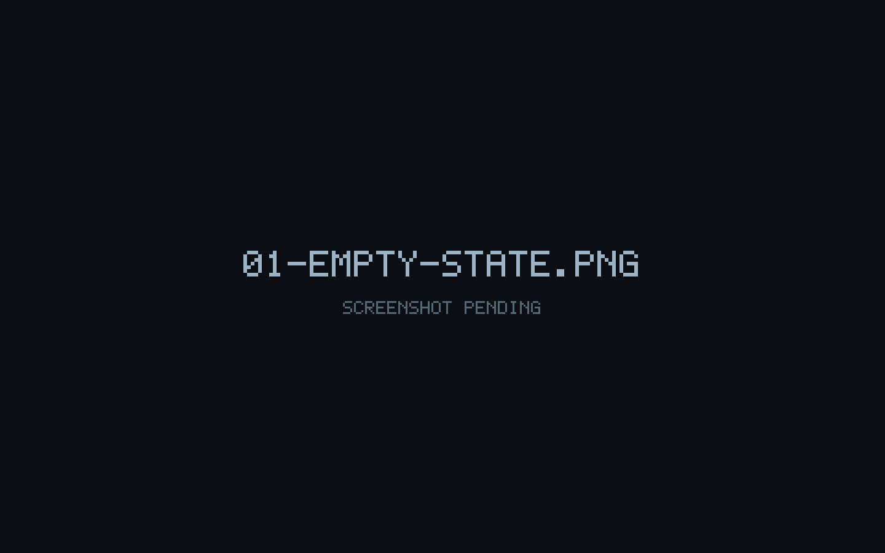
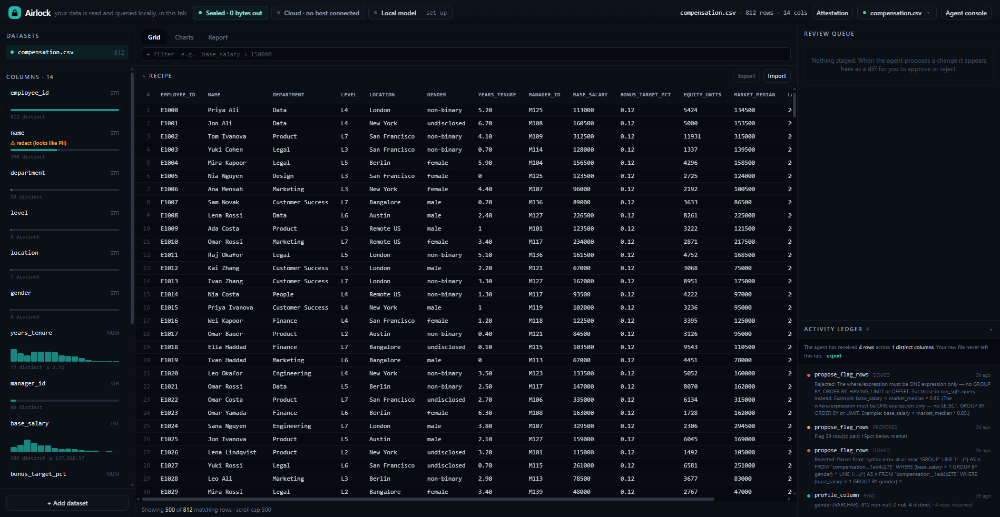
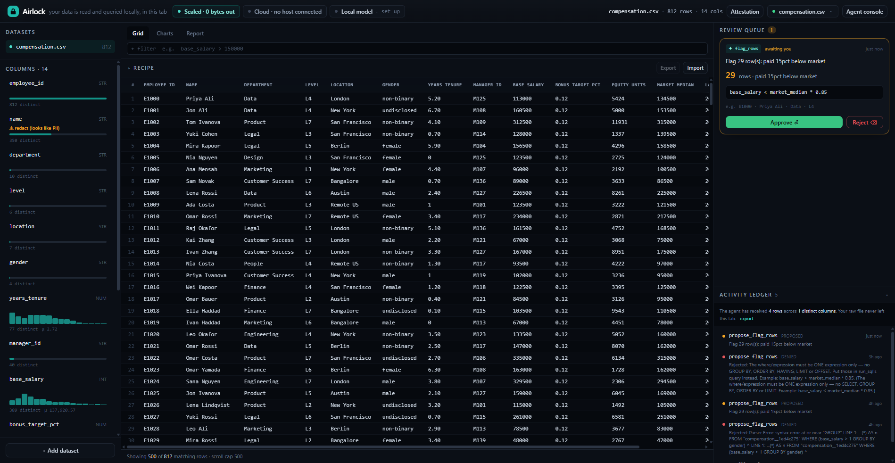
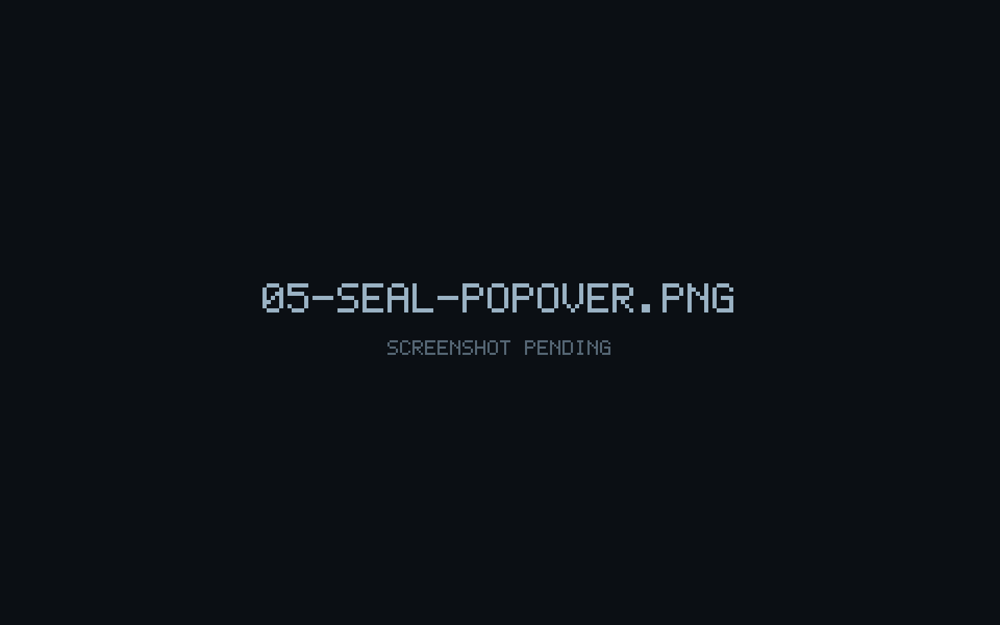

# Airlock

**An agent-native data workspace where the agent analyzes private tabular data that never leaves your browser — and every change it makes is staged as a diff you approve.**


- **Live demo:** [https://airlock-webmcp.netlify.app](https://airlock-webmcp.netlify.app) · [offline receipt verifier](https://airlock-webmcp.netlify.app/verify.html)
- **Devpost:** _TODO: add submission URL_ (OpenAI WebMCP Challenge)
- **Reusable primitive:** [`packages/webmcp-staged`](packages/webmcp-staged/) — the `propose_* → human review → commit_*` contract, published-shaped, MIT.

---

## The problem

You have a spreadsheet you would never paste into a chat window: compensation
data, a customer export, anything with names attached. Today, letting an AI agent
help you analyze it means uploading it somewhere.

Airlock removes the upload. Your file is read in the browser tab, loaded into an
in-browser [DuckDB-WASM](https://duckdb.org/docs/api/wasm/overview.html) instance,
and queried with WebAssembly. The agent works on it through a set of
[WebMCP](https://github.com/webmachinelearning/webmcp) tools the page exposes — it
never gets the file.

### The honesty caveat, stated plainly

"The data never leaves your browser" is a claim about **raw file bytes**, and
Airlock backs it with a live egress monitor (see below). It is **not** a claim
that the agent learns nothing:

- Read tools return real content to the agent — column profiles, row samples,
  query results. That is the point of the tool surface.
- Every one of those calls is recorded in the **activity ledger** with its
  arguments and a summary of what came back (`rowsDisclosed()`,
  `seenColumns()`), so "what did the agent actually see?" has a concrete answer
  you can read and export.
- You can close off a column entirely with **redaction**: mark it, and no read
  tool, aggregate, derived column or join can surface its values to the agent
  again — enforced at the SQL layer, not just hidden in the UI.
- Exactly one tool moves data out of the tab: `export_view` writes a CSV to your
  own Downloads folder, and only after you approve it. It honors redaction too.

---

## What WebMCP is, and how Airlock uses it

WebMCP lets a web page register tools on `document.modelContext` that an external
agent (e.g. ChatGPT, or a local test host) can call directly. Airlock's entire
agent surface is defined in
[`apps/airlock/src/agent/tools.tsx`](apps/airlock/src/agent/tools.tsx), and it
uses WebMCP non-trivially in three ways:

1. **An honest read/write split.** Read tools are registered with
   `registerTool` and `readOnlyHint: true`; they run immediately and only look.
   Write tools are registered with `registerStagedTool` as a
   `propose_* / commit_* / reject_*` trio. Hosts like ChatGPT surface this split
   to the user from `readOnlyHint`.

2. **Staged approval as the centerpiece.** `propose_*` stages a typed diff and is
   itself `readOnlyHint: true` — it changes nothing. `commit_*` refuses to run
   until the matching proposal has been approved in the UI. The human's Approve
   button and the agent's `commit_*` call converge on the same code path
   ([`reviewController.ts`](apps/airlock/src/agent/reviewController.ts)).

3. **The polyfill never shadows a real host.**
   [`main.tsx`](apps/airlock/src/main.tsx) detects a native
   `document.modelContext` first and only loads
   [`@mcp-b/webmcp-polyfill`](https://www.npmjs.com/package/@mcp-b/webmcp-polyfill)
   when none is present, so a real agent always sees Airlock's real tools.

The `propose → review → commit` mechanism is packaged as a standalone,
zero-dependency library: [`packages/webmcp-staged`](packages/webmcp-staged/). See
its own README for the API.

---

## What's built

Five things sit on top of the core stage-and-approve workspace:

- **Persistence** — named sessions in IndexedDB. Reload the tab and every
  dataset, filter, derived column, rename, chart, flag, report and the
  activity ledger come back, keyed to a session you can list, switch and
  delete. Each dataset's *original source bytes* are stored and replayed
  through the same import path used on first load, so restore is
  deterministic by construction. Zero network; private windows and blocked
  storage degrade to a "not saved" pill without breaking the app.
  ([`lib/persistence.ts`](apps/airlock/src/lib/persistence.ts),
  [`components/SessionMenu.tsx`](apps/airlock/src/components/SessionMenu.tsx))
- **Recipes** — export the approved transform sequence (filters, derived
  columns, renames, flags, charts) as a versioned, git-diffable `.json` file,
  then replay it against a fresh dataset. Replay never mutates: it stages one
  proposal per step in the same review queue the agent's tools feed, and a
  step that references a missing column is reported as skipped, never
  dropped silently. ([`lib/recipes.ts`](apps/airlock/src/lib/recipes.ts),
  [`components/RecipePanel.tsx`](apps/airlock/src/components/RecipePanel.tsx))
- **Citations** — the agent cites evidence in `write_report` with a plain
  `[cite:<ledgerEntryId>]` marker pointing at a prior read-tool call. Valid
  citations render as clickable footnote chips; a citation with a missing id
  or one that resolves to a non-read entry renders as broken and is logged.
  The proposal preview shows cited / uncited / broken counts before you
  approve. Citations are forward-only: a report that cited a query before a
  column was later redacted still resolves — the ledger is an immutable
  transparency record, not retroactively scrubbed.
  ([`agent/citations.ts`](apps/airlock/src/agent/citations.ts))
- **Redaction** — mark a column redacted from `ColumnList` (or let the agent
  propose it via `propose_redact_column`; only a human can lift one). Once
  redacted, no read tool, `run_sql` fragment, aggregate, derived column, join
  or export can surface its values — enforced lexically in the SQL guard
  (`assertNoRedactedColumns`, `assertNoStarProjection`), not just hidden in
  the UI, and every refused attempt is logged as `denied`.
  ([`engine/pii.ts`](apps/airlock/src/engine/pii.ts) suggests likely-PII
  columns on load; nothing is redacted automatically.)
- **Real data in/out** — import CSV, TSV, JSON, Parquet, PDF and plain text (.md/.log) (DuckDB-WASM's
  natively linked reader — zero new dependencies), plus clipboard-pasted
  delimited text with delimiter auto-sniffing and a local file via the File
  System Access API. Export stays CSV-only through the single staged
  `export_view` tool — there is deliberately no second, ungated export path.
  `.xlsx` was prototyped and then removed: the only SheetJS release on the
  npm registry at the time (`xlsx@0.18.5`) carried two unpatched high-severity
  advisories, and shipping a vulnerable parser for untrusted files contradicts
  a security-first product. `npm audit --omit=dev` is clean on `main`.
  ([`engine/loadFile.ts`](apps/airlock/src/engine/loadFile.ts),
  [`lib/importFormats.ts`](apps/airlock/src/lib/importFormats.ts))

---

## Architecture

Monorepo, npm workspaces. `npm install` at the root installs everything.

```
packages/webmcp-staged/       Reusable primitive: propose_* -> human review -> commit_*.
                              Zero-dependency core + optional React bindings + honest
                              readOnlyHint. MIT, published-shaped.
  src/core.ts                 registerTool, registerStagedTool, ProposalStore, feature detection.
  src/react.ts                useWebMCPTool, useStagedTool, useProposals, useWebMCPAvailable.
  src/webmcp-types.ts         Local types for document.modelContext.

apps/airlock/
  src/main.tsx                Entry point. Installs the egress monitor first, detects a
                              native WebMCP host before importing the polyfill, mounts React.
  src/engine/
    duckdb.ts                 DuckDB-WASM wrapper (self-hosted wasm + workers), runQuery,
                              the SQL guards (assertSelectOnly / assertExpression /
                              assertIdentifier / assertNoRedactedColumns /
                              assertNoStarProjection), CSV/JSON/Parquet import.
    datasetStore.ts           Per-dataset store (factory). buildViewSql composes filters +
                              derived columns + renames; the base table is never mutated.
                              Redaction state, PII suggestions, serialize()/hydrate().
    workspaceStore.ts         Dataset list, active dataset, cross-dataset joins, per-source
                              bytes for persistence, format dispatch for import.
    pii.ts                    Pre-flight heuristic that suggests likely-PII columns on load.
    uiStore.ts                Tab + console + activity-panel + load/error UI state.
    useDataset.ts             React hooks over the stores.
    loadFile.ts               Thin client-side file-load helpers (file, paste, picker, demo).
  src/agent/
    tools.tsx                 The whole WebMCP surface: 8 read tools + 12 staged actions.
    activity.ts               The transparency ledger (every read/propose/commit/reject/denied).
    citations.ts              [cite:<id>] marker parsing + resolution against the ledger.
    reviewController.ts       Bridges the Approve button and commit_* to one commit path.
    reports.ts                Insight-report store (agent-drafted markdown findings).
    previews.tsx / previewTypes.ts Typed diff previews rendered in the review queue.
    hooks.ts                  React hooks for reports.
  src/lib/
    egress.ts                 Wraps fetch / XMLHttpRequest / sendBeacon / WebSocket and counts
                              every byte the page tries to send. Backs the Seal indicator.
    persistence.ts            IndexedDB session store: save/list/switch/delete, autosave,
                              one-time boot restore.
    recipes.ts                Recipe schema, serialize/parse, plan + replay through the
                              review queue.
    csv.ts                    rowsToCsv + downloadText (used by export_view).
    importFormats.ts          Format detection by extension/MIME + delimiter sniffing.
    markdown.tsx              marked + DOMPurify, twice — once for the base report, again
                              (widened allowlist) after citation chips are injected.
    format.ts                 Number / byte / relative-time formatting.
  src/components/             React UI. TopBar (+ SessionMenu, SealStatus, WebMCPStatus),
                              LeftRail (DatasetSwitcher, ColumnList with the redact control,
                              FileDrop), CenterTabs, RecipePanel, DataGrid, FilterBar,
                              ChartPanel, ReportPanel, RightRail (ReviewPanel + ProposalCard,
                              ActivityLog), AgentConsole, LoadingIndicator, EmptyState.
  scripts/gen-demo.mjs        Regenerates the bundled demo CSVs (synthetic, no real people).
  public/demo/                compensation.csv, headcount.csv — loaded client-side only.
```

### Non-negotiable conventions

- **The base table is immutable.** Filters, derived columns and renames are
  view-level (`buildViewSql`). Every agent- or human-supplied SQL fragment —
  `run_sql`, `preview_rows`'s `where`, and each staged `prepare()` preview — is
  checked by one of the `assertSelectOnly` / `assertExpression` /
  `assertIdentifier` guards before it reaches DuckDB, and again in the
  `DatasetStore` mutators. They reject multiple statements, mutating keywords and
  network-capable functions, including URLs hidden inside a SQL comment.
- **A redacted column is a hard boundary.** `assertNoRedactedColumns` and
  `assertNoStarProjection` reject any agent SQL that names — or `*`-expands to
  — a redacted column, in any position: `SELECT`, `WHERE`, inside an
  aggregate, concatenated, aliased, in a CTE. Un-redacting is human-only; no
  tool does it.
- **The read/write split is honest.** Read tools = `registerTool` +
  `readOnlyHint: true`. Write tools = `registerStagedTool`, human-gated. No write
  tool skips the review queue.
- **Egress stays at zero after load.** No CDN fetches, no analytics, no
  telemetry. DuckDB's wasm and workers are self-hosted out of the npm package by
  Vite. The polyfill chunk is same-origin.
- **Human and agent mutate the same stores.** A filter the agent adds is
  identical to one you clicked — same grid, same charts, same undo. A recipe
  replay stages the same kind of proposal an agent's `propose_*` call would.

---

## Tool inventory

All tools are registered in
[`apps/airlock/src/agent/tools.tsx`](apps/airlock/src/agent/tools.tsx). A dataset
must be loaded first; every call is appended to the activity ledger.

### Read tools — `readOnlyHint: true`, run immediately

| Tool | Parameters | What it returns |
| --- | --- | --- |
| `list_datasets` | – | Every loaded dataset with row/column counts, its SQL `tableName` and which is active. The active dataset is always queryable as `dataset`. |
| `get_dataset_summary` | – | Active dataset: file name, SQL `tableName`, row count, every column with its type and redaction state, active filters, derived columns, renames. |
| `list_columns` | – | Columns with type, null count, distinct count and redaction state. |
| `profile_column` | `column` (string, required) | One column's full profile: type, non-null / null / distinct counts, numeric min/max/mean, up to 5 example values. A redacted column returns shape only — no min/max, no examples. |
| `preview_rows` | `limit` (number, default 25, cap 100), `where` (string, optional) | Rows from the current view (filters + derived columns + renames applied), with an optional extra `WHERE` (guarded by `assertExpression`). Redacted columns are omitted. |
| `run_sql` | `query` (string, required) | One read-only query (`SELECT` / `WITH` / `VALUES` / `EXPLAIN`), up to 200 rows. The active dataset is available as `dataset`; other datasets use the `tableName` from `list_datasets`. Cannot mutate or reach the network — `assertSelectOnly` enforces it. `SELECT *` is refused while any column is redacted. |
| `describe_workspace` | – | Everything applied to the active dataset: filters, derived columns, renames, charts, flag sets, redaction state and PII suggestions, and how many are agent-originated. |
| `get_activity_log` | – | The transparency ledger: every tool call this session, plus totals for rows disclosed and distinct columns seen. Entry ids are what a `write_report` `[cite:<id>]` marker points at. |

### Staged actions — `registerStagedTool`, human-gated

Each name below registers `propose_<name>`, `commit_<name>` and
`reject_<name>`. `propose_*` stages a typed diff (`readOnlyHint: true`);
`commit_*` runs only after approval.

| Action | Parameters | Staged change |
| --- | --- | --- |
| `add_filter` | `expression` (string, required), `label` (string, optional) | Adds a SQL boolean filter; the preview shows rows kept vs. total. Stacks with existing filters (AND). |
| `remove_filter` | `filter` (string, required — label or exact expression) | Removes one active filter. |
| `clear_filters` | – | Removes every active filter at once. |
| `add_derived_column` | `name` (string, required), `expression` (string, required) | Adds a computed view column from a SQL scalar expression; preview shows sample values. Base table untouched. |
| `remove_derived_column` | `name` (string, required) | Removes a derived column. |
| `rename_column` | `from` (string, required), `to` (string, required) | Display-only rename; the base column keeps its name, so it is reversible. |
| `redact_column` | `column` (string, required) | Once approved, the agent can no longer read the column's values by any path — rows, profiles, aggregates, derived columns, joins, export. Only a human can lift a redaction; there is no `unredact` tool. |
| `add_chart` | `title` (string), `kind` (`"bar"` \| `"line"`), `sql` (string) | Adds a chart; `sql` must return exactly `[label, value]`. Preview renders the data. |
| `flag_rows` | `where` (string), `reason` (string) | Flags matching rows for your attention with a reason. Deletes nothing. |
| `join_datasets` | `right` (string — id or file name), `on` (array of `{ left, right }`), `type` (`"inner"` \| `"left"`, optional) | Joins the active dataset to another loaded one, producing a new dataset. Redacted columns are excluded from the result and cannot be join keys. Preview shows resulting row count and columns. |
| `export_view` | `filename` (string, optional) | Exports the current transformed view as a CSV download to your Downloads folder — CSV only, redacted columns excluded. The one action that moves data out of the tab. |
| `write_report` | `title` (string), `markdown` (string) | Saves a markdown findings document to the Report tab. Numeric claims should carry a `[cite:<ledgerEntryId>]` marker; the preview shows cited / uncited / broken citation counts before you approve. |

---

## Running it

Requires **Node.js >= 20**.

```bash
npm install          # at the repo root — installs all workspaces
npm run dev           # Airlock dev server at http://localhost:5173
npm run build         # builds webmcp-staged, then airlock
npm run preview        # serve the production build locally
```

Type-check the app:

```bash
npm run typecheck --workspace apps/airlock
```

Run the tests (248 across both workspaces: 243 in `apps/airlock`, 5 in
`packages/webmcp-staged`, including a `fast-check`-based property suite over
the SQL guard):

```bash
npm test
```

Once the dev server is up, load a file by drag-and-drop, paste delimited text,
use the file picker, or pick one of the two bundled demo datasets on the
landing screen:

- **`compensation.csv`** — Compensation review (812 synthetic employees)
- **`headcount.csv`** — Headcount & managers, for the `join_datasets` demo

Supported inputs: CSV, TSV, JSON (an array of records, or a single object) and
Parquet. Files are read from your local `File` object and handed straight to
DuckDB-WASM — nothing is uploaded. (`.xlsx` is not supported — see
[What's built](#whats-built) for why.)

### Exercising the WebMCP tools without ChatGPT

**Option A — the built-in Agent console.** Press <kbd>Ctrl</kbd>/<kbd>Cmd</kbd> +
<kbd>`</kbd> (or click **Agent console** in the top bar). It lists every
registered tool and lets you invoke one with a JSON argument object through the
polyfill's testing shim, including preset "quick calls" that walk the full
`propose → approve → commit` loop. This is what the demo video drives.

**Option B — a real WebMCP host.** Enable
`chrome://flags/#enable-webmcp-testing` and use the WebMCP Inspector extension,
or connect the page from a native host. `main.tsx` will detect the native
`document.modelContext` and skip the polyfill; `WebMCP connected` appears in the
top bar.

---

## How the guarantees are enforced

- **Egress monitor** ([`src/lib/egress.ts`](apps/airlock/src/lib/egress.ts)) is
  installed as the first statement in `main.tsx`, before any module can capture
  the original `fetch`. It wraps `fetch`, `XMLHttpRequest`,
  `navigator.sendBeacon` and `WebSocket`, counts request-body bytes and records
  external hosts. Same-origin asset GETs (app chunks, the DuckDB `.wasm`, the
  demo CSV) are counted separately. The **Seal** indicator in the top bar shows
  the live count and reads `Sealed · 0 bytes out` when nothing with a body or a
  cross-origin target has gone out.
- **The SQL guards**
  ([`src/engine/duckdb.ts`](apps/airlock/src/engine/duckdb.ts)) — `assertSelectOnly`
  for a whole query, `assertExpression` for a scalar/boolean fragment,
  `assertIdentifier` for a bare column name, plus `assertNoRedactedColumns` and
  `assertNoStarProjection` for the redaction boundary — all lexical, run on a
  copy with string literals and comments neutralized. They reject multiple
  statements, every mutating keyword (`insert`, `update`, `delete`, `drop`,
  `create`, `attach`, `copy`, `pragma`, `install`, `load`, …), every
  network-capable function (`read_csv`, `read_parquet`, `parquet_scan`, `glob`,
  and any `http(s)` / `s3` / `file://` reference — including one hidden inside a
  SQL comment), and any reference to a redacted column. They run at two layers:
  the WebMCP tool boundary and again in the `DatasetStore` mutators. They err
  toward refusing, and a rejected fragment is logged as `denied`.
- **Redaction is enforced below the UI, not instead of it.** Marking a column
  redacted in `ColumnList` sets state that the SQL guards check on every
  subsequent query — there is no code path that reads a redacted column's
  values and simply declines to render them; the value never leaves DuckDB in
  the first place for an agent-issued query.
- **Untrusted report rendering**
  ([`src/lib/markdown.tsx`](apps/airlock/src/lib/markdown.tsx)): agent-authored
  report markdown is parsed with `marked` and scrubbed with `DOMPurify` — no raw
  HTML, no scripts, an allow-list of tags and only `href` attributes. Citation
  chips are injected into that already-sanitized HTML and the result is passed
  through `DOMPurify` a second time with a minimally widened allowlist, so
  agent text never reaches the chip-rendering pass as trusted markup.

---

## Screenshots

Images live in [`docs/screenshots/`](docs/screenshots/). See
[`docs/screenshots/README.md`](docs/screenshots/README.md) for the full shot
list and captions.

| | |
| --- | --- |
|  |  |
| **Landing screen with drop zone** — load a spreadsheet you would never paste into a chat window. | **Loaded dataset with the Seal** — the agent and the human share one workspace. |
|  |  |
| **Staged review queue** — every change the agent proposes is staged as a diff you approve. | **Transparency activity ledger** — the honest answer to what the agent actually saw. |
|  |  |
| **Egress Seal popover** — data never leaves the browser, made measurable. | **Built-in agent console** — drive the full propose to approve to commit loop. |

---

## License

[MIT](LICENSE) © 2026 Sadath Anwar.

The reusable primitive in [`packages/webmcp-staged`](packages/webmcp-staged/) is
also MIT and carries its own `LICENSE` file.
